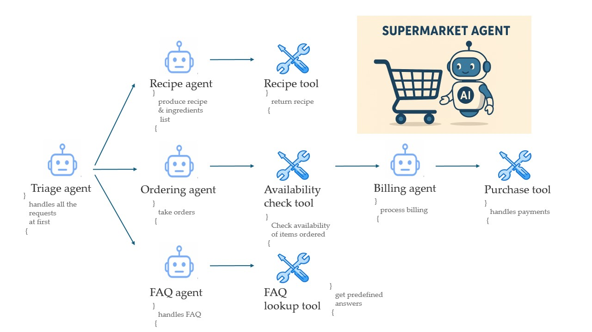

# 🛒 Super Market Agent using OpenAI Agents SDK

## 📖 Table of Contents

* [General Overview](#general-overview)
* [General Workflow](#general-workflow)
* [OpenAI Agents SDK Overview](#openai-agents-sdk-overview)
* [System Architecture](#system-architecture) 
* [Agents and Tools](#agents-and-tools)
* [Setup and Usage](#setup-and-usage)
* [Dependencies](#dependencies)
* [Features](#features)
* [Contributing](#contributing)
* [Contact](#contact)

---

## 🧾 General Overview

**Super-Market-Agent-using-OpenAI-Agents-SDK** is an intelligent supermarket assistant application built using **OpenAI's Agents SDK** to automate and enhance the shopping experience.
The application consists of **multiple agents and tools** working together to handle the entire purchasing process — from taking an order to generating a recipe and billing.

---

## ⚙️ General Workflow

1. **Customer Input:**
   The customer provides a list of items they want to buy.
2. **Item Verification:**
   The agent checks the availability of the requested items and confirms with the customer.
3. **Billing & Purchase:**
   Once confirmed, the system proceeds to billing and order finalization.
4. **Meal Assistance Feature:**
   If the customer mentions a desired meal instead of items, the agent identifies the required ingredients, generates a recipe, and produces a final bill for those ingredients.

---

## 🧠 OpenAI Agents SDK Overview

The **OpenAI Agents SDK** allows modular control by defining specific **agents** and **tools** to handle individual workflows.
This structure provides:

* Greater control over the process flow
* Seamless handoffs between agents
* Natural language understanding for context-driven automation

In simple terms, the SDK lets developers use LLMs not just for conversation, but to **manage complex workflows with predefined logic and control with natural language understanding**.

> For more information, refer to the [OpenAI Agents SDK Documentation](https://platform.openai.com/docs/agents).

---

## 🧱 System Architecture
The following diagram illustrates the overall structure of the Super Market Agent system and how different agents interact with each other:



---

## 🧩 Agents and Tools

| Agent / Tool                | Description                                                                               |
| --------------------------- | ----------------------------------------------------------------------------------------- |
| **faq_lookup_tool**         | Tool used by `faq_agent` to answer common queries.                                        |
| **availability_check_tool** | Used by `ordering_agent` to verify item availability.                                     |
| **recipe_tool**             | Used by `recipe_agent` to return recipes and ingredient lists.                          |
| **purchase_tool**           | Used by `billing_agent` to handle purchase and billing process.                           |
| **faq_agent**               | Handles general customer FAQs.                                                            |
| **billing_agent**           | Processes confirmed orders and performs billing.                                          |
| **ordering_agent**          | Handles the ordering process after triage handoff.                                        |
| **recipe_agent**            | Generates recipes and provides ingredient lists for a given meal.                         |
| **triage_agent**            | Main entry point; handles initial interactions and delegates tasks to the relevant agent, and takes control when needed. |

> **Note:** Each agent operates independently according to its defined instructions and responsibilities.

---

## ⚡ Setup and Usage

### 🛠️ Prerequisites

* Python 3.10 or higher
* OpenAI SDK with Agents support
* API key from OpenAI

### 🚀 Installation

```bash
# Clone the repository
git clone https://github.com/LaksLaksman/Super-Market-Agent-using-OpenAI-Agents-SDK.git
cd Super-Market-Agent-using-OpenAI-Agents-SDK

# Create virtual environment
python -m venv venv
source venv/bin/activate   # For Windows: venv\Scripts\activate

# Install dependencies
pip install -r requirements.txt
```

### ▶️ Run the Application

```bash
python main.py
```

Once started, interact with the system through the command line or integrated chat interface.

---

## 📦 Dependencies

* `openai` (Agents SDK)
* `python-dotenv`
* `requests`
* `json`
  

---

## ✨ Features

✅ Multi-agent architecture for modular control
✅ Automated item availability checking
✅ Intelligent recipe generation from meal inputs
✅ Seamless handoff between agents for smooth workflow
✅ Billing and order management automation
✅ FAQ handling using natural language

---

## 🤝 Contributing

Contributions are welcome!
If you'd like to help enhance this project and build a complete supermarket agent experience, feel free to:

1. Fork the repository
2. Create a feature branch
3. Submit a pull request

---

## 📬 Contact

**Developer:** Laksman Puvanayokeswaran
📧 Email: [joylaksman@gmail.com](mailto:joylaksman@gmail.com)
🔗 LinkedIn: [www.linkedin.com/in/laksmanp](https://www.linkedin.com/in/laksmanp)

---